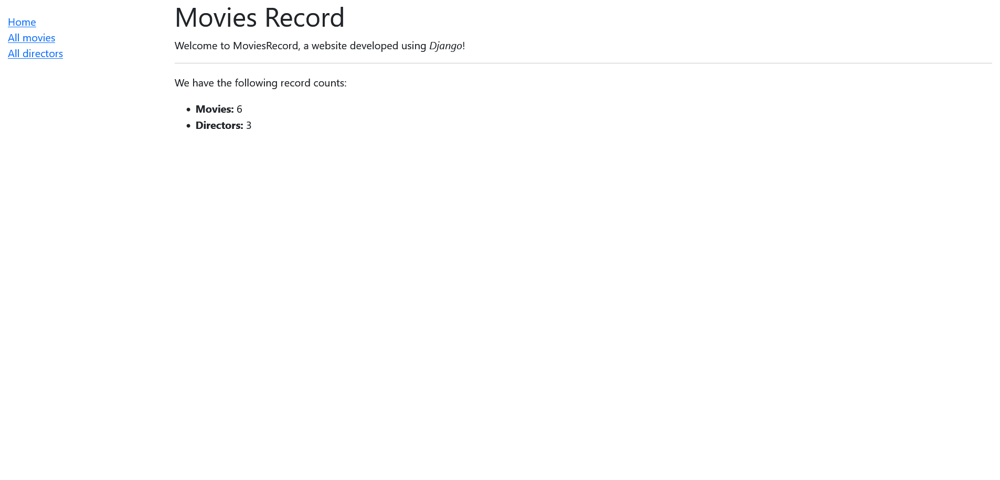

### Directores de cine

- En este ejercicio tendrás que crear una aplicación en Django que almacene datos de directores de cine y luego se puedan ver sus películas, así como una descripción de las mismas.

- Tienes que personalizar el admin de la aplicación y a su vez crear las vistas de cada una de las partes de la aplicación.

---

### Screenshots

---

##### Admin

